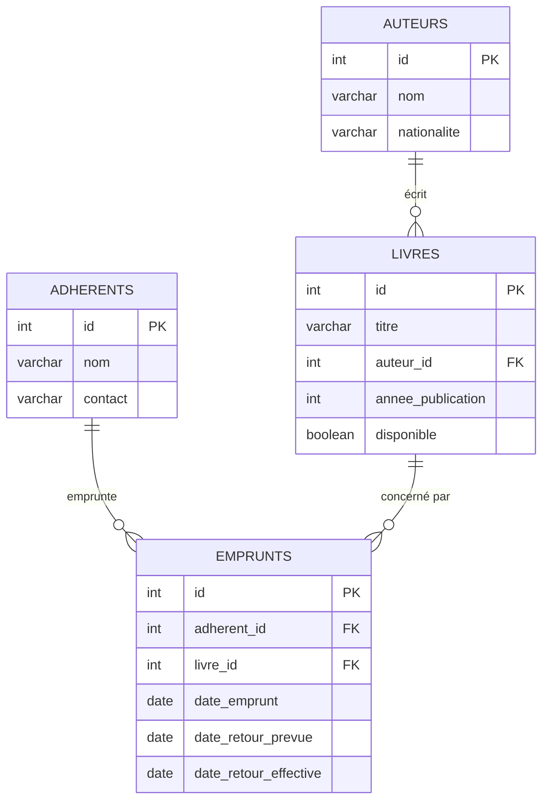

# Diagramme entité-relation

GitHub affiche ce bloc Mermaid directement dans le README/ERD.md — pas besoin d'image externe.
Un `emprunt` "en cours" = `date_retour_effective IS NULL`.
Un `emprunt` "en retard" = `date_retour_effective IS NULL` ET `date_retour_prevue < CURRENT_DATE`.
